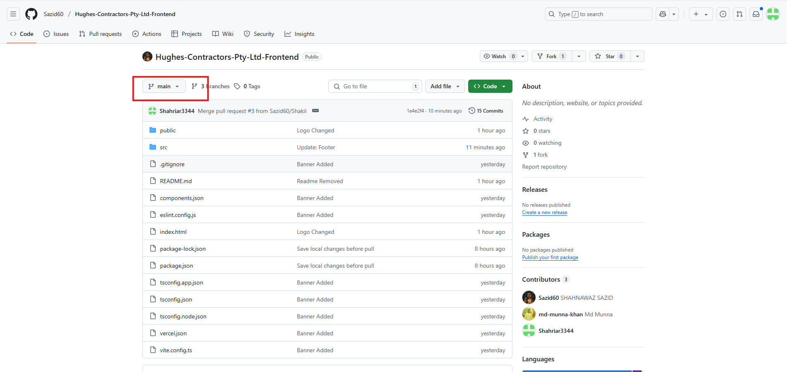
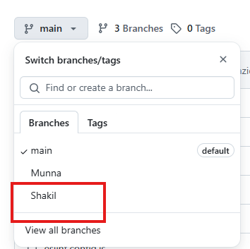
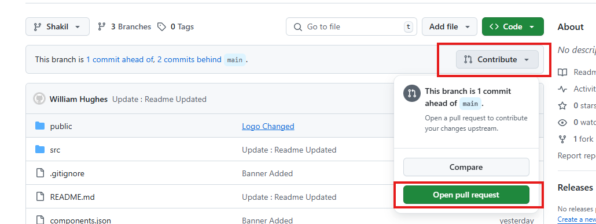
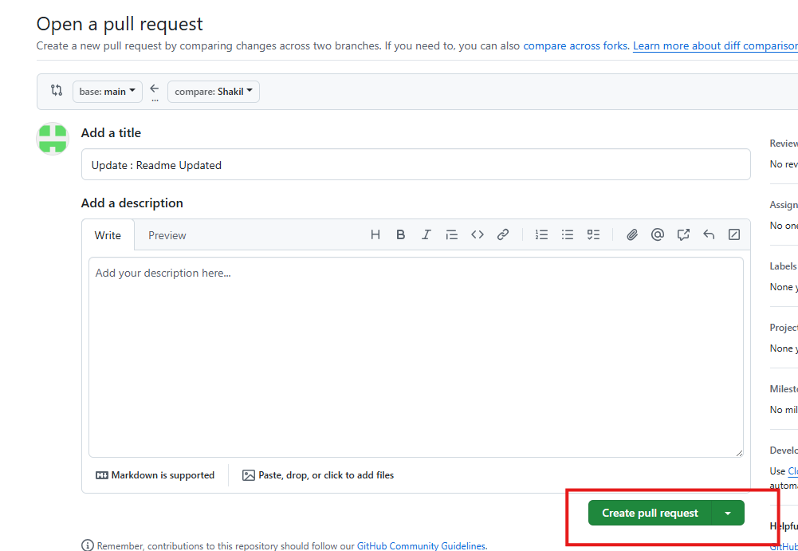

---

## 🛠 Git & Development Workflow

### 🔹 Open Command Prompt
```bash
cmd
```

### 🔹 Open Project in VS Code
```bash
code .
```

### 🔹 Run Development Server
```bash
npm run dev
```

### 🔹 Stop Development Server
```bash
Ctrl + C
```

### 🔹 Open VS Code Terminal
```bash
Ctrl + J
```

### 🔹 Stage All Changes
```bash
git add .
```

### 🔹 Commit Changes
```bash
git commit -m "Update: Title Changed"
```

### 🔹 Push to Remote Branch
```bash
git push origin Shakil
```

---

### ✅ Quick Reference

| Action                   | Command                  |
|--------------------------|--------------------------|
| Open terminal            | `cmd`                    |
| Open project in VS Code  | `code .`                 |
| Start dev server         | `npm run dev`            |
| Stop dev server          | `Ctrl + C`               |
| Open terminal in VS Code | `Ctrl + J`               |
| Stage changes            | `git add .`              |
| Commit changes           | `git commit -m "..."`    |
| Push to branch           | `git push origin Shakil` |

---










